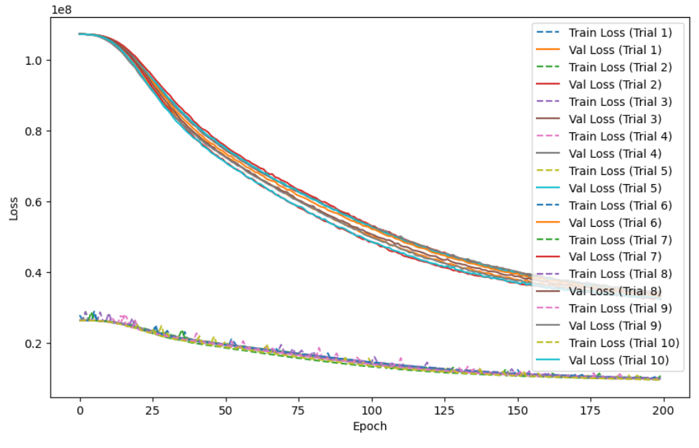

# Customer Lifetime Value

This project is mean't to demonstrate usage with actual customer information to determine the customer lifetime value that we are able to achieve. This is done using two models, one GN/ Negative Binomial Distribution and a Feed Forward Network

